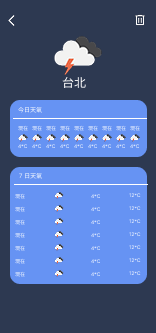

# WeatherKotlin

一個使用 Kotlin + Jetpack Compose 開發的天氣應用程式，採用 Clean Architecture + MVVM 架構。

## 功能

- 自動取得當前位置天氣（需授權定位權限）
- 預設顯示台北天氣（未授權定位時）
- 搜尋城市並加入追蹤清單（自動防止重複新增）
- 建議城市快速新增（高雄、桃園、台中、新竹）
- 顯示城市當前天氣（溫度、天氣狀態、最高/最低溫）
- 查看城市詳細天氣預報（逐時天氣、7日預報）
- 下拉更新天氣資料（Shimmer 骨架動畫）
- 刪除已追蹤的城市
- 搜尋歷史記錄

## 技術架構

### 架構模式

- **Clean Architecture** - 分離 Domain、Data、Presentation 層
- **MVVM** (Model-View-ViewModel)
- **Repository Pattern** - 統一資料來源管理
- **Use Cases** - 封裝業務邏輯

### 技術棧

| 類別 | 技術 |
|------|------|
| UI | Jetpack Compose + Material 3 |
| 導航 | Navigation Compose |
| 網路 | Retrofit + OkHttp + Gson |
| 本地儲存 | Room Database |
| 依賴注入 | Hilt |
| 圖片載入 | Coil |
| 非同步 | Kotlin Coroutines + Flow |
| 定位服務 | Google Play Services Location |
| 權限處理 | Accompanist Permissions |

### 專案結構

```text
app/src/main/java/com/example/weatherkotlin/
├── WeatherApp.kt                    # Hilt Application
├── MainActivity.kt                  # @AndroidEntryPoint
├── domain/                          # Domain Layer
│   ├── model/                       # Domain Models
│   │   ├── CityWeather.kt
│   │   ├── HourlyWeather.kt
│   │   ├── DailyWeather.kt
│   │   ├── ForecastResult.kt
│   │   ├── Location.kt
│   │   └── PreviewData.kt
│   ├── repository/                  # Repository Interfaces
│   │   ├── WeatherRepository.kt
│   │   └── LocationRepository.kt
│   └── usecase/                     # Use Cases
│       ├── GetAllCityWeatherUseCase.kt
│       ├── RefreshAllWeatherUseCase.kt
│       ├── GetForecastUseCase.kt
│       ├── DeleteCityWeatherUseCase.kt
│       ├── AddCurrentLocationCityUseCase.kt
│       └── InitializeDefaultCityUseCase.kt
├── data/                            # Data Layer
│   ├── local/                       # Room Database
│   │   ├── CityWeatherEntity.kt
│   │   ├── CityWeatherDao.kt
│   │   ├── SearchHistoryEntity.kt
│   │   ├── SearchHistoryDao.kt
│   │   ├── SearchHistoryRepository.kt
│   │   └── WeatherDatabase.kt
│   ├── remote/                      # Retrofit API
│   │   ├── WeatherApi.kt
│   │   └── dto/
│   │       ├── WeatherResponse.kt
│   │       ├── ForecastResponse.kt
│   │       └── GeoResponse.kt
│   ├── location/                    # Location Service
│   │   └── LocationRepositoryImpl.kt
│   └── repository/                  # Repository Implementations
│       ├── WeatherRepositoryImpl.kt
│       └── SearchRepositoryImpl.kt
├── di/
│   └── AppModule.kt                 # Hilt DI Module
├── navigation/
│   └── WeatherNavigation.kt
└── ui/                              # Presentation Layer
    ├── theme/                       # Theme
    ├── components/                  # Shared UI Components
    │   ├── WeatherCard.kt
    │   ├── HourlyWeatherRow.kt
    │   └── DailyWeatherRow.kt
    ├── home/
    │   ├── HomeScreen.kt
    │   └── HomeViewModel.kt
    └── detail/
        ├── DetailScreen.kt
        └── DetailViewModel.kt

feature/search/                      # Search Feature Module
└── src/main/java/com/example/search/
    ├── domain/
    │   ├── model/
    │   │   └── SearchResult.kt
    │   ├── repository/
    │   │   └── SearchRepository.kt
    │   └── usecase/
    │       ├── SearchCitiesUseCase.kt
    │       ├── AddCityUseCase.kt
    │       └── GetSuggestedCitiesUseCase.kt
    └── presentation/
        ├── SearchScreen.kt
        ├── SearchViewModel.kt
        ├── SearchUiState.kt
        ├── component/
        │   └── SearchBar.kt
        └── theme/
            └── SearchTheme.kt
```

## 資料流程

```text
┌─────────────────────────────────────────────────────────────────┐
│                      Presentation Layer                          │
│  ┌─────────────┐     ┌──────────────┐     ┌─────────────────┐   │
│  │   UI Layer  │ ──> │  ViewModel   │ ──> │    Use Cases    │   │
│  │  (Compose)  │ <── │  (StateFlow) │ <── │                 │   │
│  └─────────────┘     └──────────────┘     └────────┬────────┘   │
└────────────────────────────────────────────────────┼────────────┘
                                                     │
┌────────────────────────────────────────────────────┼────────────┐
│                       Domain Layer                  │            │
│                    ┌────────────────────────────────┴───┐        │
│                    │        Repository Interfaces       │        │
│                    └────────────────────────────────────┘        │
└────────────────────────────────────────────────────┬────────────┘
                                                     │
┌────────────────────────────────────────────────────┼────────────┐
│                        Data Layer                   │            │
│    ┌────────────┬───────────────────────────────────┼────────────┤
│    │            │               │               │   │            │
│    v            v               v               v   v            │
│ ┌───────────┐ ┌───────────┐ ┌─────────────┐ ┌───────────┐        │
│ │ WeatherApi│ │ Geocoding │ │   Room DB   │ │ Location  │        │
│ │ (天氣API) │ │ (城市搜尋) │ │ (本地快取)  │ │ Service   │        │
│ └───────────┘ └───────────┘ └─────────────┘ └───────────┘        │
└─────────────────────────────────────────────────────────────────┘
```

## API 端點

| API | 用途 |
|-----|------|
| `GET /data/2.5/weather` | 取得當前天氣 |
| `GET /data/2.5/forecast` | 取得 5 天/3小時預報 |
| `GET /geo/1.0/direct` | 城市名稱搜尋 |

## 資料來源

[OpenWeatherMap API](https://openweathermap.org/api)

## 安裝/設定

1. Clone 專案並在 Android Studio 開啟
1. 在專案根目錄的 `local.properties` 加入 API Key：

   ```text
   OPENWEATHER_API_KEY=your_api_key_here
   ```

1. Build & Run：

   ```bash
   ./gradlew assembleDebug
   ```

## 畫面預覽

| 首頁 | 詳情頁 | 搜尋頁 |
|------|--------|--------|
|  |  |  |
| 天氣卡片列表 + 下拉更新 | 逐時天氣 + 7日預報 + 刪除 | 建議城市 + 搜尋結果 |
