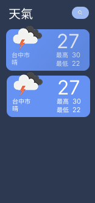

# WeatherKotlin

A weather forecast app built with Kotlin + Jetpack Compose, following Clean Architecture + MVVM pattern.

## Features

- Auto-detect current location weather (requires location permission)
- Default city (Taipei) when location permission denied
- Search and add cities to tracking list (prevents duplicates)
- Quick-add suggested cities (Kaohsiung, Taoyuan, Taichung, Hsinchu)
- Display current weather (temperature, condition, high/low temp)
- View detailed forecast (hourly weather, 5-day forecast)
- Pull-to-refresh with skeleton loading animation
- Remove tracked cities
- Search history

## Tech Stack

### Architecture

- **Clean Architecture** - Domain, Data, Presentation layers
- **MVVM** (Model-View-ViewModel)
- **Repository Pattern** - Unified data source management
- **Use Cases** - Encapsulated business logic

### Libraries

| Category | Technology |
|----------|------------|
| UI | Jetpack Compose + Material 3 |
| Navigation | Navigation Compose |
| Network | Retrofit + OkHttp + Gson |
| Local Storage | Room Database |
| DI | Hilt |
| Image Loading | Coil |
| Async | Kotlin Coroutines + Flow |
| Location | Google Play Services Location |
| Permissions | Accompanist Permissions |

### Project Structure

```text
app/src/main/java/com/example/weatherkotlin/
├── WeatherApp.kt                    # Hilt Application
├── MainActivity.kt                  # @AndroidEntryPoint
├── domain/                          # Domain Layer
│   ├── model/                       # Domain Models
│   │   ├── CityWeather.kt
│   │   ├── HourlyWeather.kt
│   │   ├── DailyWeather.kt
│   │   ├── ForecastResult.kt
│   │   ├── Location.kt
│   │   └── AddCityResult.kt
│   ├── repository/                  # Repository Interfaces
│   │   ├── WeatherRepository.kt
│   │   └── LocationRepository.kt
│   └── usecase/                     # Use Cases
│       ├── city/
│       │   ├── AddCurrentLocationCityUseCase.kt
│       │   ├── DeleteCityWeatherUseCase.kt
│       │   └── InitializeDefaultCityUseCase.kt
│       └── weather/
│           ├── GetAllCityWeatherUseCase.kt
│           ├── GetForecastUseCase.kt
│           └── RefreshAllWeatherUseCase.kt
├── data/                            # Data Layer
│   ├── local/                       # Room Database
│   │   ├── CityWeatherEntity.kt
│   │   ├── CityWeatherDao.kt
│   │   ├── SearchHistoryEntity.kt
│   │   ├── SearchHistoryDao.kt
│   │   └── WeatherDatabase.kt
│   ├── remote/                      # Retrofit API
│   │   ├── WeatherApi.kt
│   │   ├── ApiKeyInterceptor.kt
│   │   └── dto/
│   │       ├── WeatherResponse.kt
│   │       ├── ForecastResponse.kt
│   │       └── GeoResponse.kt
│   ├── repository/                  # Repository Implementations
│   │   ├── WeatherRepositoryImpl.kt
│   │   ├── SearchRepositoryImpl.kt
│   │   ├── LocationRepositoryImpl.kt
│   │   └── SearchHistoryRepository.kt
│   └── util/
│       └── DateTimeFormatter.kt
├── di/
│   └── AppModule.kt                 # Hilt DI Module
├── navigation/
│   └── WeatherNavigation.kt
└── ui/                              # Presentation Layer
    ├── theme/
    │   ├── Theme.kt
    │   ├── Color.kt
    │   ├── Type.kt
    │   └── CardModifiers.kt
    ├── util/
    │   └── WeatherIconUrl.kt
    ├── components/
    │   ├── WeatherCard.kt
    │   ├── HourlyWeatherRow.kt
    │   ├── DailyWeatherRow.kt
    │   └── LocationPermissionHandler.kt
    ├── home/
    │   ├── HomeScreen.kt
    │   └── HomeViewModel.kt
    └── detail/
        ├── DetailScreen.kt
        └── DetailViewModel.kt

feature/search/                      # Search Feature Module
└── src/main/java/com/example/search/
    ├── domain/
    │   ├── model/
    │   │   ├── SearchResult.kt
    │   │   └── AddedCityInfo.kt
    │   ├── repository/
    │   │   └── SearchRepository.kt
    │   └── usecase/
    │       ├── SearchCitiesUseCase.kt
    │       ├── AddCityUseCase.kt
    │       └── GetSuggestedCitiesUseCase.kt
    └── presentation/
        ├── SearchScreen.kt
        ├── SearchViewModel.kt
        ├── SearchUiState.kt
        ├── component/
        │   └── SearchBar.kt
        └── theme/
            └── SearchTheme.kt
```

## Data Flow

```text
┌─────────────────────────────────────────────────────────────────┐
│                      Presentation Layer                          │
│  ┌─────────────┐     ┌──────────────┐     ┌─────────────────┐   │
│  │   UI Layer  │ ──> │  ViewModel   │ ──> │    Use Cases    │   │
│  │  (Compose)  │ <── │  (StateFlow) │ <── │                 │   │
│  └─────────────┘     └──────────────┘     └────────┬────────┘   │
└────────────────────────────────────────────────────┼────────────┘
                                                     │
┌────────────────────────────────────────────────────┼────────────┐
│                       Domain Layer                  │            │
│                    ┌────────────────────────────────┴───┐        │
│                    │        Repository Interfaces       │        │
│                    └────────────────────────────────────┘        │
└────────────────────────────────────────────────────┬────────────┘
                                                     │
┌────────────────────────────────────────────────────┼────────────┐
│                        Data Layer                   │            │
│    ┌────────────┬───────────────────────────────────┼────────────┤
│    │            │               │               │   │            │
│    v            v               v               v   v            │
│ ┌───────────┐ ┌───────────┐ ┌─────────────┐ ┌───────────┐        │
│ │ WeatherApi│ │ Geocoding │ │   Room DB   │ │ Location  │        │
│ │           │ │   API     │ │ (Cache)     │ │ Service   │        │
│ └───────────┘ └───────────┘ └─────────────┘ └───────────┘        │
└─────────────────────────────────────────────────────────────────┘
```

## API Endpoints

| API | Purpose |
|-----|---------|
| `GET /data/2.5/weather` | Get current weather |
| `GET /data/2.5/forecast` | Get 5-day / 3-hour forecast |
| `GET /geo/1.0/direct` | Search city by name |

## Data Source

[OpenWeatherMap API](https://openweathermap.org/api)

## Setup

1. Clone the project and open in Android Studio

2. Add API key to `local.properties` in project root:

   ```text
   OPENWEATHER_API_KEY=your_api_key_here
   ```

3. Build & Run:

   ```bash
   ./gradlew assembleDebug
   ```

## Screenshots

| Home | Detail | Search |
|------|--------|--------|
|  |  |  |
| City weather cards + Pull-to-refresh | Hourly + 5-day forecast + Delete | Suggested cities + Search results |

## AI Tools

This project was developed with AI assistance. See [AI_TOOLS.md](AI_TOOLS.md) for details.
